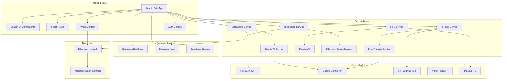
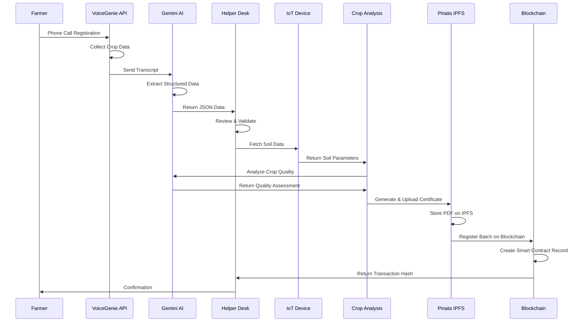
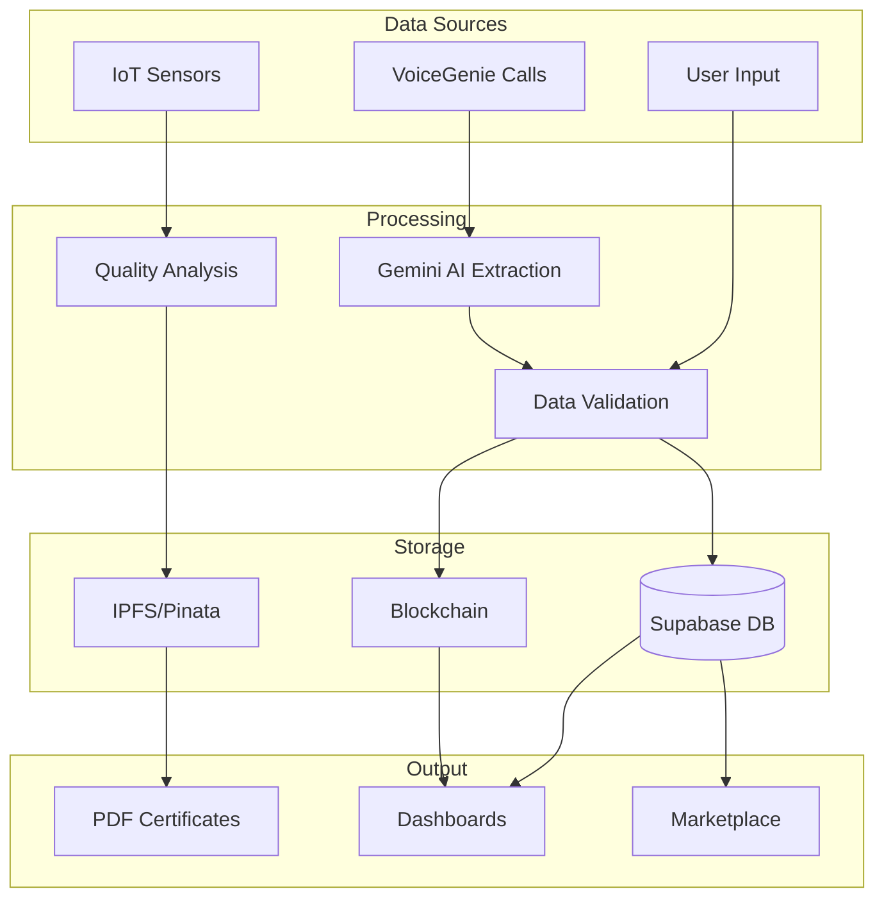
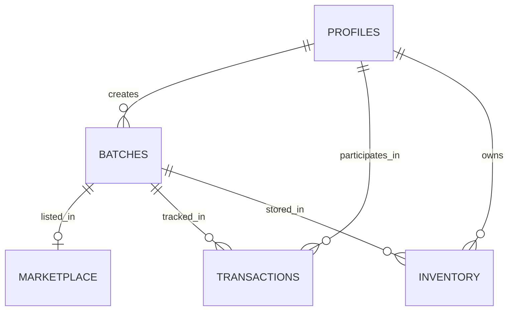

# 🌾 AgriTrace - Agricultural Supply Chain Transparency Platform

<div align="center">


**A revolutionary blockchain-powered platform ensuring complete transparency and traceability in agricultural supply chains from farm to table.**

[Features](#-key-features) • [Architecture](#-architecture) • [Setup](#-getting-started) • [Documentation](#-documentation) • [Contributing](#-contributing)

</div>

---

## 📋 Table of Contents

- [Overview](#-overview)
- [Key Features](#-key-features)
- [Architecture](#-architecture)
- [Tech Stack](#-tech-stack)
- [Getting Started](#-getting-started)
- [User Roles & Workflows](#-user-roles--workflows)
- [API Integrations](#-api-integrations)
- [Database Schema](#-database-schema)
- [Deployment](#-deployment)
- [Contributing](#-contributing)
- [License](#-license)

---

## 🎯 Overview

AgriTrace is a comprehensive agricultural supply chain management platform developed for the **Government of Odisha**. It leverages cutting-edge technologies including **blockchain**, **AI-powered quality analysis**, and **IoT integration** to ensure complete transparency, traceability, and fair pricing throughout the agricultural supply chain.

### Mission

To empower farmers across Odisha with modern technology that provides:
- ✅ Complete transparency in the agricultural supply chain
- ✅ Fair pricing through market data integration
- ✅ Consumer trust through verifiable blockchain certificates
- ✅ Food security through quality assurance
- ✅ Accessibility for farmers without internet via voice-based registration

---

## ✨ Key Features

### 🔐 Authentication & Authorization
- **Multi-role access control**: Farmer, Distributor, Retailer, Admin
- **Web3 wallet integration**: MetaMask and other Ethereum wallets
- **Secure authentication**: Supabase Auth with JWT tokens
- **Role-based dashboard**: Customized views for each user type

### 📦 Batch Registration
- **Voice-based registration**: Phone call registration via VoiceGenie API for farmers without internet
- **AI-powered data extraction**: Google Gemini AI extracts structured data from conversation transcripts
- **IoT soil data integration**: Real-time soil quality analysis from hardware sensors
- **Crop quality assessment**: AI-powered analysis using Gemini 2.5 Flash
- **PDF certificate generation**: Automated harvest certificates with QR codes
- **IPFS storage**: Immutable certificate storage on Pinata IPFS
- **Blockchain registration**: Ethereum smart contract integration for permanent records

### 🛒 Marketplace System
- **Multi-tier marketplace**: Separate marketplaces for farmers, distributors, and retailers
- **Real-time price suggestions**: Integration with mandi price APIs
- **Inventory management**: Track batches through supply chain stages
- **Purchase transactions**: Blockchain-verified ownership transfers
- **QR code scanning**: Quick product verification and tracking

### 📊 Supply Chain Tracking
- **End-to-end traceability**: Track products from farm to consumer
- **Transaction history**: Complete blockchain transaction records
- **Certificate verification**: Verify authenticity of harvest certificates
- **Supply chain visualization**: Visual representation of product journey

### 🤖 AI & IoT Integration
- **VoiceGenie integration**: Voice-based batch registration for offline farmers
- **Google Gemini AI**: Transcript analysis and crop quality assessment
- **IoT soil sensors**: Real-time soil data (temperature, humidity, moisture, pH, NPK levels)
- **Crop health analysis**: AI-powered quality assessment based on soil data

### 🎨 Modern UI/UX
- **Responsive design**: Mobile-first approach with Tailwind CSS
- **Shadcn UI components**: Beautiful, accessible component library
- **Dark mode support**: Theme switching capability
- **Real-time updates**: Live data synchronization

---

## 🏗️ Architecture

### System Architecture Overview



### Batch Registration Flow



### Supply Chain Flow

```mermaid
graph LR
    A[Farmer<br/>Registers Batch] --> B[Generate<br/>Certificate]
    B --> C[Upload to<br/>IPFS]
    C --> D[Register on<br/>Blockchain]
    D --> E[Farmer<br/>Marketplace]
    E --> F[Distributor<br/>Purchases]
    F --> G[Update<br/>Ownership]
    G --> H[Distributor<br/>Inventory]
    H --> I[Distributor<br/>Marketplace]
    I --> J[Retailer<br/>Purchases]
    J --> K[Update<br/>Ownership]
    K --> L[Retailer<br/>Inventory]
    L --> M[End Consumer]
    
    style A fill:#90EE90
    style F fill:#87CEEB
    style J fill:#DDA0DD
    style M fill:#FFB6C1
```



### Data Flow Architecture



---

## 🛠️ Tech Stack

### Frontend
- **Framework**: React 18.3 with TypeScript
- **Build Tool**: Vite 5.4
- **UI Library**: Shadcn UI (Radix UI primitives)
- **Styling**: Tailwind CSS 3.4
- **Routing**: React Router DOM 6.30
- **State Management**: React Context API + TanStack Query
- **Forms**: React Hook Form + Zod validation
- **Charts**: Recharts 2.15
- **PDF Generation**: jsPDF 3.0
- **QR Codes**: qrcode 1.5

### Blockchain
- **Network**: Ethereum
- **Library**: Ethers.js 6.15
- **Smart Contracts**: Solidity 0.8.20
- **Contract Framework**: OpenZeppelin Contracts

### Backend & Database
- **Database**: Supabase (PostgreSQL)
- **Authentication**: Supabase Auth
- **Storage**: Supabase Storage + Pinata IPFS
- **API**: RESTful APIs

### AI & External Services
- **AI Service**: Google Gemini 2.5 Flash API
- **Voice Service**: VoiceGenie API
- **IoT Integration**: Hardware API (REST)
- **Price Data**: Mandi Price APIs
- **IPFS**: Pinata IPFS Service

### Development Tools
- **Language**: TypeScript 5.8
- **Linting**: ESLint 9.32
- **Package Manager**: npm
- **Version Control**: Git

---

## 🚀 Getting Started

### Prerequisites

- **Node.js** >= 18.x
- **npm** >= 9.x
- **Git**
- **MetaMask** or compatible Web3 wallet
- **Supabase Account** (for database and auth)
- **API Keys**:
  - Google Gemini API Key
  - VoiceGenie API Key (optional for voice registration)
  - Pinata API Key (for IPFS storage)

### Installation

1. **Clone the repository**
   ```bash
   git clone https://github.com/kjarir/AgriTrace.git
   cd AgriTrace
   ```

2. **Install dependencies**
   ```bash
   npm install
   ```

3. **Set up environment variables**
   
   Create a `.env` file in the root directory:
   ```env
   # Supabase Configuration
   VITE_SUPABASE_URL=your_supabase_project_url
   VITE_SUPABASE_ANON_KEY=your_supabase_anon_key
   
   # Google Gemini API (Required for AI features)
   VITE_GEMINI_API_KEY=your_gemini_api_key
   
   # VoiceGenie API (Optional - for voice registration)
   VITE_VOICEGENIE_API_KEY=your_voicegenie_api_key
   
   # Pinata IPFS (Required for certificate storage)
   VITE_PINATA_JWT=your_pinata_jwt_token
   
   # Ethereum Network
   VITE_CONTRACT_ADDRESS=your_smart_contract_address
   VITE_NETWORK=sepolia  # or mainnet, localhost
   ```

4. **Set up Supabase Database**
   
   Run the SQL scripts in order:
   ```bash
   # Connect to your Supabase project SQL editor
   # Run these scripts:
   - fix_role_constraint_complete.sql
   - add_analysis_columns.sql
   - add_group_id_column.sql
   ```

5. **Deploy Smart Contract** (Optional for local development)
   
   ```bash
   # Deploy to local network or testnet
   # Update VITE_CONTRACT_ADDRESS in .env
   ```

6. **Start development server**
   ```bash
   npm run dev
   ```

7. **Open in browser**
   ```
   http://localhost:5173
   ```

### Building for Production

```bash
npm run build
```

The production build will be in the `dist` directory.

---

## 👥 User Roles & Workflows

### 🌾 Farmer

**Capabilities:**
- Register new crop batches via web form or phone call
- View registered batches and certificates
- Access farmer marketplace (view only, cannot purchase)
- Track batch status and ownership transfers
- View market price suggestions

**Registration Flow:**
1. Connect Web3 wallet (MetaMask)
2. Fill batch registration form or call VoiceGenie
3. System fetches IoT soil data automatically
4. AI analyzes crop quality based on soil parameters
5. PDF certificate generated with QR code
6. Certificate uploaded to IPFS
7. Batch registered on blockchain
8. Farmer receives confirmation

### 🏪 Distributor

**Capabilities:**
- Purchase batches from farmer marketplace
- Manage distributor inventory
- Sell batches to retailers via distributor marketplace
- View transaction history
- Track supply chain

**Purchase Flow:**
1. Browse farmer marketplace
2. Select batch and review certificate
3. Initiate purchase transaction
4. Approve blockchain transaction
5. Ownership transferred on-chain
6. Batch added to distributor inventory

### 🛒 Retailer

**Capabilities:**
- Purchase batches from distributor marketplace
- Manage retailer inventory
- View product details and certificates
- Track supply chain history
- QR code scanning for verification

**Purchase Flow:**
1. Browse distributor marketplace
2. Select batch and verify certificate
3. Complete purchase transaction
4. Ownership transferred
5. Batch added to retailer inventory

### 👨‍💼 Admin

**Capabilities:**
- Access Helper Desk for voice registration review
- Approve/reject batch registrations from phone calls
- View system analytics
- Manage user roles
- Monitor system health

**Helper Desk Workflow:**
1. View pending voice registrations
2. Review extracted data and confidence scores
3. Validate information completeness
4. Approve or request corrections
5. System processes approved registrations

---

## 🔌 API Integrations

### VoiceGenie API
- **Purpose**: Voice-based batch registration for farmers without internet
- **Endpoint**: `https://voiceagent-6h5b.onrender.com/api/calls`
- **Method**: GET
- **Authentication**: API Key
- **Response**: Call transcripts, conversation data, metadata

### Google Gemini API
- **Purpose**: 
  - Extract structured data from voice transcripts
  - Analyze crop quality based on soil data
- **Model**: `gemini-2.5-flash`
- **Endpoint**: `https://generativelanguage.googleapis.com/v1beta/models/gemini-2.5-flash:generateContent`
- **Authentication**: API Key
- **Features**:
  - Natural language understanding
  - JSON structured output
  - Multi-language support (Hindi, Odia, Telugu, English)

### IoT Hardware API
- **Purpose**: Fetch real-time soil sensor data
- **Endpoint**: `https://hardwareapi-4xbs.onrender.com/latest`
- **Method**: GET
- **Data Points**:
  - Temperature
  - Humidity
  - Soil Moisture
  - pH Level
  - NPK Levels (Nitrogen, Phosphorus, Potassium)
  - Light (LDR)
  - Gas levels
  - Rain detection

### Pinata IPFS
- **Purpose**: Store harvest certificates immutably
- **Service**: Pinata IPFS
- **Features**:
  - Group-based file organization
  - JWT authentication
  - Metadata storage
  - Direct IPFS gateway access

### Mandi Price API
- **Purpose**: Provide market price suggestions
- **Integration**: Multiple mandi price APIs
- **Data**: Real-time crop prices by location

---

## 🗄️ Database Schema

### Core Tables

#### `profiles`
- User profile information
- Role-based access (farmer, distributor, retailer, admin)
- Wallet address linkage

#### `batches`
- Crop batch registration data
- Links to IPFS certificates
- Blockchain transaction hashes
- Crop analysis data (JSONB)
- Soil data (JSONB)

#### `marketplace`
- Available batches for sale
- Pricing information
- Availability status
- Owner information

#### `transactions`
- Supply chain transaction records
- Buyer/seller information
- Blockchain transaction hashes
- Timestamps

#### `inventory` (Distributor/Retailer)
- Current inventory holdings
- Batch ownership
- Quantity tracking

### Key Relationships



---

## 🚢 Deployment

### Environment Setup

1. **Set production environment variables**
   ```env
   VITE_SUPABASE_URL=production_url
   VITE_SUPABASE_ANON_KEY=production_key
   VITE_GEMINI_API_KEY=production_key
   VITE_CONTRACT_ADDRESS=mainnet_contract_address
   VITE_NETWORK=mainnet
   ```

2. **Build the application**
   ```bash
   npm run build
   ```

3. **Deploy to hosting platform**
   - **Vercel**: Connect GitHub repo, auto-deploy
   - **Netlify**: Drag & drop `dist` folder
   - **AWS S3 + CloudFront**: Upload `dist` to S3 bucket
   - **GitHub Pages**: Use GitHub Actions

### Smart Contract Deployment

1. **Compile contract**
   ```bash
   npx hardhat compile
   ```

2. **Deploy to network**
   ```bash
   npx hardhat run scripts/deploy.js --network mainnet
   ```

3. **Update contract address** in `.env`

### Database Migration

Run Supabase migrations in production:
1. Connect to production Supabase project
2. Run SQL scripts in order
3. Verify schema matches development

---

## 📚 Documentation

### Additional Documentation Files

- **[ENV_SETUP.md](./ENV_SETUP.md)**: Detailed environment variable setup
- **[OMNIDIM_INTEGRATION_ROADMAP.md](./OMNIDIM_INTEGRATION_ROADMAP.md)**: Voice integration roadmap
- **[COMPLETE_SUPPLY_CHAIN_FLOW.md](./COMPLETE_SUPPLY_CHAIN_FLOW.md)**: Supply chain flow details

### Key Service Files

- `src/services/geminiService.ts`: AI data extraction
- `src/services/voicegenieService.ts`: Voice call integration
- `src/services/iotSoilDataService.ts`: IoT data fetching
- `src/services/cropAnalysisService.ts`: Crop quality analysis
- `src/utils/singleStepGroupManager.ts`: IPFS certificate management
- `src/utils/blockchainTransactionManager.ts`: Blockchain interactions

---

## 🤝 Contributing

We welcome contributions! Please follow these steps:

1. **Fork the repository**
2. **Create a feature branch**
   ```bash
   git checkout -b feature/amazing-feature
   ```
3. **Make your changes**
4. **Commit your changes**
   ```bash
   git commit -m 'Add some amazing feature'
   ```
5. **Push to the branch**
   ```bash
   git push origin feature/amazing-feature
   ```
6. **Open a Pull Request**

### Code Style

- Follow TypeScript best practices
- Use ESLint for linting
- Write meaningful commit messages
- Add comments for complex logic
- Update documentation for new features

---

## 📄 License

This project is licensed under the MIT License - see the [LICENSE](LICENSE) file for details.

---

## 🙏 Acknowledgments

- **Government of Odisha** for the initiative
- **OpenZeppelin** for smart contract security patterns
- **Supabase** for backend infrastructure
- **Shadcn** for UI components
- **VoiceGenie** for voice integration
- **Google Gemini** for AI capabilities

---

## 📞 Support

For support, email support@agritrace.gov.in or open an issue in the repository.

---

<div align="center">

**Built with ❤️ for the farmers of Odisha**

[Website](https://agritrace.gov.in) • [Documentation](https://docs.agritrace.gov.in) • [GitHub](https://github.com/kjarir/AgriTrace)

</div>
