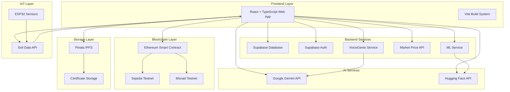
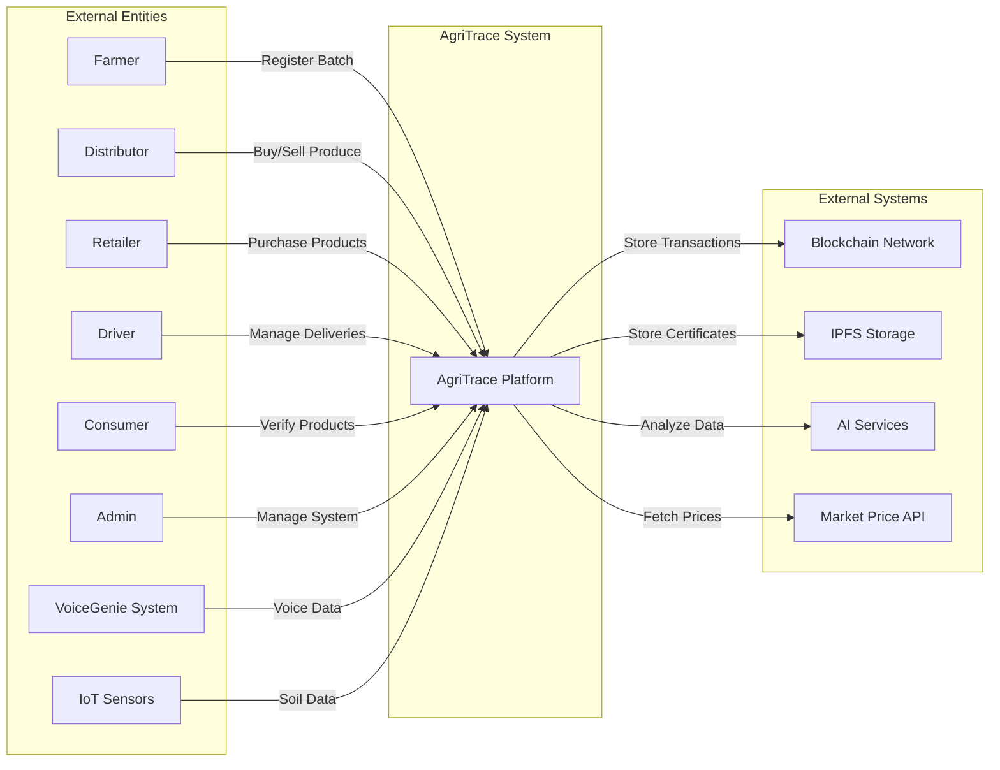
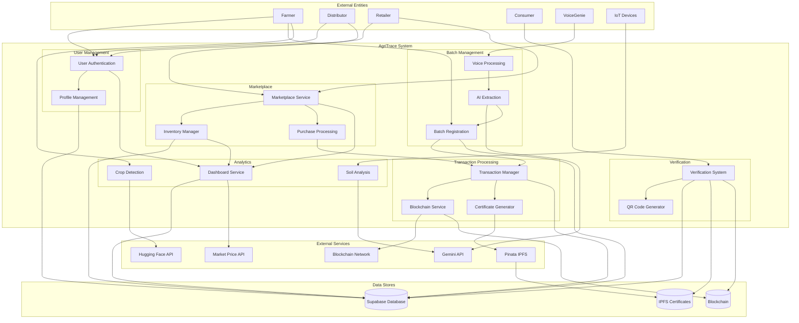
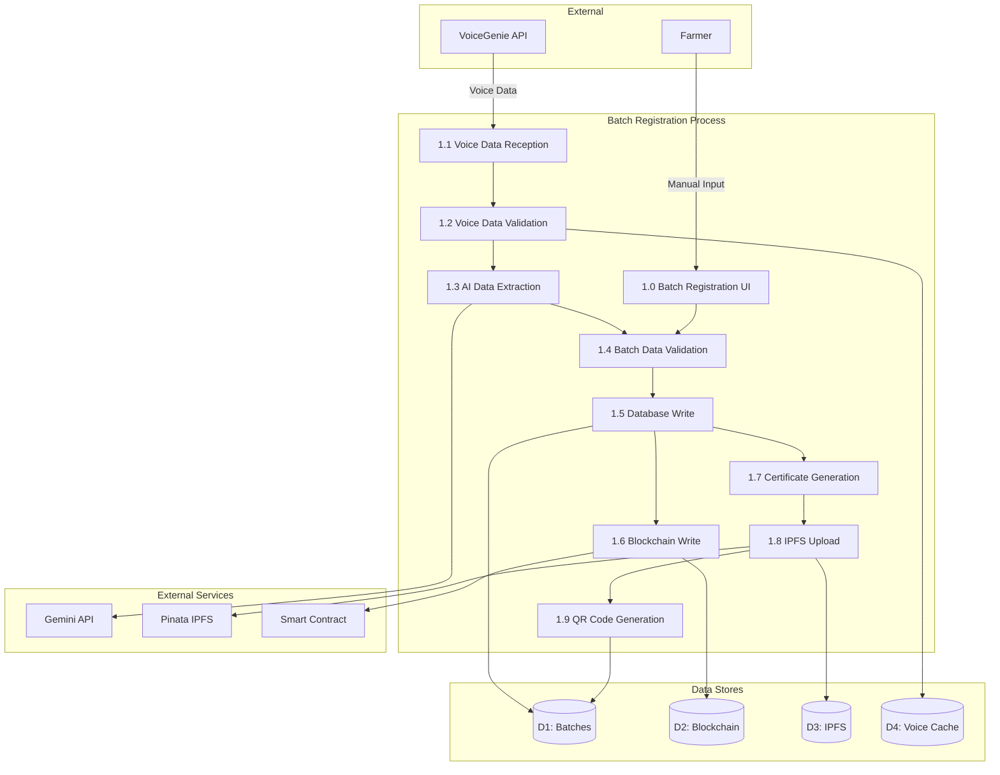
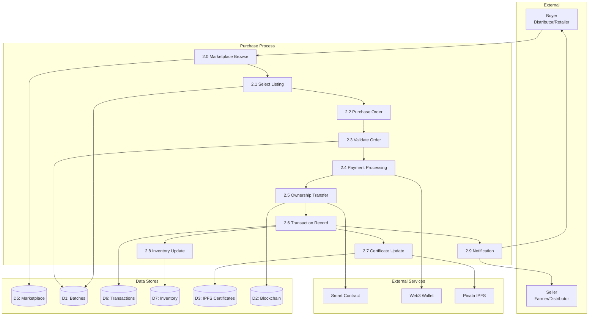
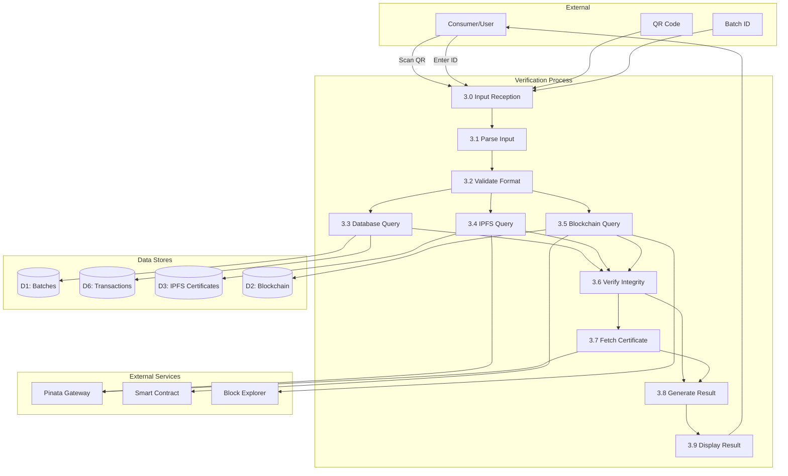
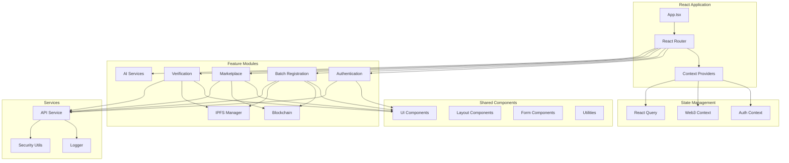
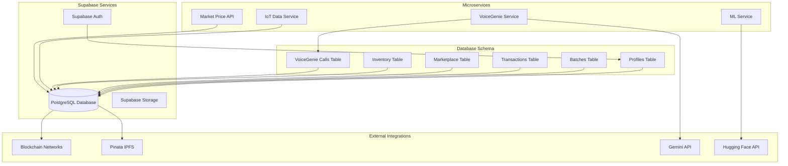
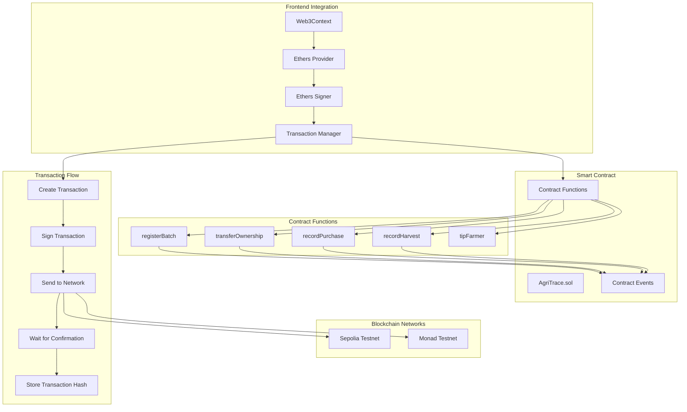

# 🌾 AgriTrace - Blockchain-Powered Agricultural Supply Chain Management

<div align="center">


**Transparent • Traceable • Trustworthy**

A revolutionary blockchain-based platform ensuring complete transparency and traceability from farm to table.

[Features](#-features) • [Architecture](#-architecture) • [Installation](#-installation) • [Usage](#-usage) • [Documentation](#-documentation)

</div>

---

## 📋 Table of Contents

- [Overview](#-overview)
- [Features](#-features)
- [Architecture](#-architecture)
- [Data Flow Diagrams](#-data-flow-diagrams)
- [System Architecture](#-system-architecture)
- [Technology Stack](#-technology-stack)
- [Installation](#-installation)
- [Configuration](#-configuration)
- [Usage](#-usage)
- [User Roles](#-user-roles)
- [API Documentation](#-api-documentation)
- [Security](#-security)
- [Contributing](#-contributing)
- [License](#-license)

---

## 🎯 Overview

AgriTrace is a comprehensive blockchain-powered agricultural supply chain management system designed to provide complete transparency, traceability, and trust in the agricultural supply chain. It enables farmers, distributors, retailers, and consumers to track produce from cultivation to consumption using immutable blockchain records and decentralized IPFS storage.

### Mission
To empower farmers across Odisha with modern technology that provides complete transparency in the agricultural supply chain, ensures fair pricing, builds consumer trust, and promotes food security through verifiable, blockchain-powered certificates.

### Key Benefits
- ✅ **Immutable Records**: All transactions stored on blockchain (Sepolia/Monad testnets)
- ✅ **IPFS Certificates**: Decentralized storage via Pinata for harvest/purchase certificates
- ✅ **Voice Registration**: AI-powered batch registration via VoiceGenie phone calls
- ✅ **AI Analysis**: Crop health detection, soil analysis, and quality assessment
- ✅ **QR Code Tracking**: Instant verification via QR codes
- ✅ **IoT Integration**: Real-time soil data from ESP32 sensors
- ✅ **Marketplace**: Direct trading between farmers, distributors, and retailers
- ✅ **Supply Chain Tracking**: Complete visibility from farm to table

---

## ✨ Features

### Core Features
- 🔐 **Authentication & Authorization**: Role-based access control (Farmer, Distributor, Retailer, Driver, Admin)
- 📝 **Batch Registration**: Manual and voice-based (VoiceGenie) batch registration
- ⛓️ **Blockchain Integration**: Smart contract-based transaction management
- 📄 **Certificate Generation**: Automated harvest and purchase certificate creation
- 🔍 **Verification System**: QR code and batch ID verification
- 🛒 **Marketplace**: Multi-tier marketplace for different user roles
- 📊 **Inventory Management**: Real-time inventory tracking for distributors and retailers
- 🚚 **Truck Pooling**: Efficient delivery management and driver allocation
- 🌱 **AI Services**: Crop health detection, soil analysis, disease prediction
- 📱 **IoT Integration**: Real-time soil monitoring via ESP32 sensors
- 📈 **Analytics Dashboard**: Comprehensive dashboards for all user roles

---

## 🏗️ Architecture

### High-Level System Architecture



---

## 📊 Data Flow Diagrams

### DFD Level 0 - Context Diagram



### DFD Level 1 - System Decomposition



### DFD Level 2 - Detailed Process Flows

#### 2.1 Batch Registration Process



#### 2.2 Purchase/Transaction Process



#### 2.3 Verification Process



---

## 🎨 System Architecture

### Frontend Architecture



### Backend Architecture



### Blockchain Architecture



---

## 🛠️ Technology Stack

### Frontend
- **Framework**: React 18.3.1
- **Language**: TypeScript 5.8.3
- **Build Tool**: Vite 5.4.19
- **Styling**: Tailwind CSS 3.4.17
- **UI Components**: Radix UI + shadcn/ui
- **State Management**: React Context API + React Query
- **Routing**: React Router DOM 6.30.1
- **Forms**: React Hook Form + Zod validation
- **Charts**: Recharts 2.15.4

### Backend
- **Database**: Supabase (PostgreSQL)
- **Authentication**: Supabase Auth
- **API**: RESTful APIs via Supabase
- **Real-time**: Supabase Realtime subscriptions

### Blockchain
- **Smart Contracts**: Solidity 0.8.20
- **Web3 Library**: Ethers.js 6.15.0
- **Networks**: Sepolia Testnet, Monad Testnet
- **Contract Framework**: OpenZeppelin Contracts

### Storage
- **IPFS**: Pinata (Pinata Cloud)
- **Certificate Storage**: IPFS via Pinata Gateway
- **File Upload**: Pinata API

### AI Services
- **Natural Language**: Google Gemini 2.5 Flash
- **Computer Vision**: Hugging Face Inference API
- **Models**: 
  - Plant Disease Detection (liriope/PlantDiseaseDetection)
  - Crop Quality Analysis

### Microservices
- **Voice Processing**: VoiceGenie API Integration
- **Market Prices**: AgriInfoExtractor API
- **IoT Data**: ESP32 Hardware Integration
- **ML Service**: Python FastAPI Service

### DevOps & Tools
- **Package Manager**: npm/bun
- **Linting**: ESLint 9.32.0
- **Type Checking**: TypeScript ESLint
- **Version Control**: Git
- **Security**: Environment variables, input validation, secure logging

---

## 📦 Installation

### Prerequisites
- Node.js 18+ or Bun
- npm or yarn or bun
- Git
- MetaMask or compatible Web3 wallet
- Supabase account
- Pinata account
- API keys for Gemini, Hugging Face (optional)

### Step 1: Clone Repository
```bash
git clone https://github.com/your-org/AgriTrace-2.0.git
cd AgriTrace-2.0
```

### Step 2: Install Dependencies
```bash
npm install
# or
bun install
```

### Step 3: Environment Configuration
Create a `.env` file in the root directory:

```bash
cp .env.example .env
```

Configure all required environment variables (see [Configuration](#-configuration) section).

### Step 4: Database Setup
1. Create a Supabase project at https://supabase.com
2. Run the SQL migrations from `supabase-indexes.sql`
3. Configure Supabase URL and keys in `.env`

### Step 5: Blockchain Setup
1. Deploy the smart contract (`AgriTrace_Updated.sol`) to Sepolia/Monad testnet
2. Update `VITE_CONTRACT_ADDRESS` in `.env`
3. Configure RPC URLs for your chosen network

### Step 6: Start Development Server
```bash
npm run dev
# or
bun dev
```

The application will be available at `http://localhost:8080`

---

## ⚙️ Configuration

### Required Environment Variables

```env
# Supabase
VITE_SUPABASE_URL=https://your-project.supabase.co
VITE_SUPABASE_ANON_KEY=your-anon-key

# Blockchain
VITE_CONTRACT_ADDRESS=0xYourContractAddress
VITE_SEPOLIA_RPC_URL=https://sepolia.infura.io/v3/your-key
VITE_MONAD_RPC_URL=https://testnet-rpc.monad.xyz
VITE_DEFAULT_NETWORK=sepolia

# Pinata IPFS
VITE_PINATA_API_KEY=your-api-key
VITE_PINATA_API_SECRET=your-api-secret
VITE_PINATA_JWT=your-jwt-token
VITE_PINATA_GATEWAY_URL=https://gateway.pinata.cloud/ipfs/

# VoiceGenie
VITE_VOICEGENIE_API_BASE_URL=https://voiceagent-6h5b.onrender.com/api
VITE_VOICEGENIE_API_KEY=your-api-key

# AI Services
VITE_GEMINI_API_KEY=your-gemini-key
VITE_HUGGINGFACE_API_KEY=your-hf-key

# IoT Proxy (Optional)
VITE_IOT_PROXY_TARGET=https://hardwareapi-4xbs.onrender.com
```

See `.env.example` for complete configuration template.

---

## 🚀 Usage

### For Farmers

1. **Register Account**: Sign up as a Farmer
2. **Connect Wallet**: Link MetaMask wallet
3. **Register Batch**: 
   - Manual: Fill form with crop details
   - Voice: Call VoiceGenie number and follow prompts
4. **View Certificates**: Access harvest certificates with QR codes
5. **List on Marketplace**: List produce for sale
6. **Track Transactions**: View all blockchain transactions

### For Distributors

1. **Register Account**: Sign up as Distributor
2. **Browse Marketplace**: View available produce from farmers
3. **Purchase**: Buy batches, ownership transferred on blockchain
4. **Manage Inventory**: Track purchased batches
5. **Resell**: List batches for retailers
6. **Track Supply Chain**: View complete transaction history

### For Retailers

1. **Register Account**: Sign up as Retailer
2. **Browse Distributor Marketplace**: View available products
3. **Purchase**: Buy from distributors
4. **Manage Inventory**: Track retail inventory
5. **Generate Purchase Certificates**: Create certificates for each purchase
6. **Verify Products**: Verify product authenticity via QR codes

### For Consumers

1. **Verify Products**: 
   - Scan QR code on product
   - Enter batch ID manually
   - View complete supply chain history
2. **View Certificates**: Download harvest and purchase certificates
3. **Check Authenticity**: Verify blockchain records

### For Drivers

1. **Register Account**: Sign up as Driver
2. **View Available Deliveries**: Browse pending delivery requests
3. **Accept Deliveries**: Accept delivery assignments
4. **Track Status**: Update delivery status
5. **Manage Profile**: Update vehicle and availability info

---

## 👥 User Roles

### Farmer
- Register agricultural batches
- Generate harvest certificates
- List produce on marketplace
- View transaction history
- Receive payments
- Access AI crop analysis

### Distributor
- Purchase from farmers
- Manage inventory
- List products for retailers
- Generate purchase certificates
- Track supply chain
- View analytics dashboard

### Retailer
- Purchase from distributors
- Manage retail inventory
- Generate purchase certificates
- Track product history
- Verify products
- Access market price data

### Driver
- View delivery requests
- Accept deliveries
- Update delivery status
- Manage vehicle information
- Track delivery history

### Admin
- Manage users and roles
- View system analytics
- Monitor blockchain transactions
- Manage marketplace listings
- Configure system settings

---

## 🔐 Security

### Security Features

- ✅ **Environment Variables**: All secrets stored in environment variables
- ✅ **Input Validation**: Comprehensive sanitization and validation
- ✅ **Secure Logging**: Production-safe logging with sensitive data sanitization
- ✅ **Error Handling**: Generic error messages in production
- ✅ **HTTPS**: All API communications over HTTPS
- ✅ **CSP Headers**: Content Security Policy implemented
- ✅ **Type Safety**: Strict TypeScript configuration
- ✅ **Rate Limiting**: Client-side rate limiting for API calls
- ✅ **JWT Validation**: Secure token validation for Pinata and APIs

See [SECURITY.md](./SECURITY.md) for detailed security documentation.

---

## 📚 API Documentation

### Supabase API

All database operations use Supabase client library:

```typescript
import { supabase } from '@/integrations/supabase/client';

// Query batches
const { data, error } = await supabase
  .from('batches')
  .select('*')
  .eq('farmer_id', userId);
```

### Blockchain API

```typescript
import { transactionManager } from '@/features/blockchain/utils/transactionManager';

// Register batch on blockchain
const txHash = await transactionManager.registerBatch({
  crop: 'Rice',
  variety: 'Basmati',
  // ... other fields
});
```

### IPFS API

```typescript
import { ipfsManager } from '@/features/ipfs/utils/ipfsManager';

// Upload certificate
const ipfsHash = await ipfsManager.uploadPurchaseCertificate({
  batchId: '123',
  // ... certificate data
});
```

---

## 🤝 Contributing

We welcome contributions! Please follow these steps:

1. Fork the repository
2. Create a feature branch (`git checkout -b feature/amazing-feature`)
3. Commit your changes (`git commit -m 'Add amazing feature'`)
4. Push to the branch (`git push origin feature/amazing-feature`)
5. Open a Pull Request

### Development Guidelines

- Follow TypeScript best practices
- Write meaningful commit messages
- Add tests for new features
- Update documentation
- Follow the existing code style
- Ensure all linting checks pass

---

## 📄 License

This project is licensed under the MIT License - see the LICENSE file for details.

---

## 🙏 Acknowledgments

- **OpenZeppelin**: Smart contract security patterns
- **Supabase**: Backend infrastructure
- **Pinata**: IPFS storage solution
- **Google Gemini**: AI-powered data extraction
- **Hugging Face**: Computer vision models
- **VoiceGenie**: Voice-based batch registration

---

## 📞 Support

For support, email support@agritrace.com or create an issue in the repository.

---

## 🗺️ Roadmap

### Upcoming Features
- [ ] Mobile app (React Native)
- [ ] Multi-language support
- [ ] Advanced analytics and reporting
- [ ] Integration with more blockchain networks
- [ ] Automated testing suite
- [ ] Performance optimizations
- [ ] Enhanced AI models
- [ ] Real-time notifications

---

<div align="center">

**Built with ❤️ for transparent agriculture**

[Website](https://agritrace.com) • [Documentation](https://docs.agritrace.com) • [Blog](https://blog.agritrace.com)

</div>

